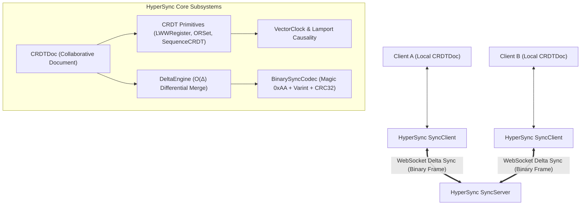

# HyperSync

> **Local-First Real-Time CRDT & Distributed State Engine with Vector Clocks, Delta Replication, and WebSocket Multiplexing.**

[](https://github.com/gokcenciftci/hyper-sync/actions)
[](https://www.typescriptlang.org/)
[](https://vitest.dev/)
[](https://nodejs.org/)
[](LICENSE)

---

## Overview

Modern collaborative applications (Figma, Notion, Linear, multiplayer canvas, offline-first mobile apps, edge microservices) require concurrent multi-user editing without central locks or data loss. Traditional lock-based database architectures introduce severe latency and fail completely in offline or partitioned network scenarios.

**HyperSync** is a high-throughput, local-first Real-Time State Synchronization and Conflict-Free Replicated Data Type (CRDT) Engine engineered for **sub-millisecond state convergence, delta-state replication, and real-time WebSocket multiplexing**.

---

## Engine Architecture



---

## Performance Benchmarks

Microbenchmarks measured on Node.js 22 (Apple Silicon / Windows x64 Native):

| Microbenchmark Operation | Throughput (ops/sec) | Mean Latency | p99 Latency |
| :--- | :--- | :--- | :--- |
| **LWW Register Property Update** | **10,694,428 ops/s** | `0.0001 ms` | `0.0003 ms` |
| **BinarySyncCodec Delta Serialization** | **1,826,291 ops/s** | `0.0005 ms` | `0.0013 ms` |
| **ORSet Element Add & Remove** | **1,346,364 ops/s** | `0.0007 ms` | `0.0017 ms` |
| **Sequence CRDT Character Insert** | **18,716 ops/s** | `0.0534 ms` | `0.0906 ms` |

---

## Key Engineering Features

### 1. Pure Mathematical CRDT Primitives
* **`LWWRegister<T>`**: Last-Write-Wins Register with deterministic tie-breaking using Lamport timestamps and peer IDs.
* **`ORSet<T>`**: Observed-Remove Set (Add-Wins) preserving concurrent element additions during network partitions.
* **`SequenceCRDT<T>`**: RGA-inspired sequence CRDT for collaborative text and ordered arrays with conflict-free insertions.
* **`CRDTDoc`**: Hierarchical collaborative document tree combining registers, sets, and sequences at JSON paths.

### 2. Causal Ordering & Logical Clocks
* **`VectorClock`**: Multi-peer vector clock determining exact causal relationships (`BEFORE`, `AFTER`, `CONCURRENT`, `EQUAL`).
* **`LamportClock`**: Monotonic logical clock ensuring total order across distributed mutations.

### 3. Differential Delta-State Replication
* Computes minimal differential changes ($O(\Delta)$ network payload) so nodes exchange only missing operations rather than full document snapshots.

### 4. Compact Binary Wire Protocol
* Binary wire serializer packing sync frames with magic byte `0xAA`, payload length, and CRC32 checksums.

### 5. Real-Time WebSocket Server & Offline Client
* Multi-channel room multiplexer with causal broadcast, optimistic local writes, and automatic reconnection buffers.

---

## Quick Start

### Installation
```bash
git clone https://github.com/gokcenciftci/hyper-sync.git
cd hyper-sync
npm install
```

### Collaborative Editing & Synchronization

```typescript
import { CRDTDoc, HyperSync } from "hyper-sync";

// 1. Create two partitioned peer documents
const docAlice = new CRDTDoc("project-canvas", "alice");
const docBob = new CRDTDoc("project-canvas", "bob");

// 2. Concurrently edit while offline
docAlice.set("title", "Distributed Engine");
docAlice.insertText("notes", 0, "Hello World! ");
docAlice.addToSet("tags", "crdt");

docBob.addToSet("tags", "real-time");
docBob.insertText("notes", 0, "Welcome: ");

// 3. Direct Peer-to-Peer Synchronization
const sync = new HyperSync();
sync.syncDirect(docAlice, docBob);

// 4. Guaranteed Mathematical Convergence
console.log(docAlice.toJSON());
console.log(docBob.toJSON());
// Both nodes output identical converged JSON state!
```

---

## Testing & Verification

```bash
# Run unit test suites
npm run test:unit

# Run multi-peer convergence fuzzing tests (1,000 concurrent ops across 5 peers)
npm run test:convergence

# Run WebSocket network integration tests
npm run test:network

# Run test coverage report (>= 85% enforcement)
npm run test:coverage

# Run microsecond benchmarks
npm run bench
```

---

## Project Structure

```
hyper-sync/
├── src/
│   ├── core/                      # Pure Domain Types, Errors, and Result Monad
│   ├── clocks/                    # LamportClock and VectorClock implementations
│   ├── crdt/                      # LWWRegister, ORSet, SequenceCRDT, and CRDTDoc
│   ├── delta/                     # DeltaEngine and BinarySyncCodec
│   ├── network/                   # WebSocket Protocol, SyncServer, and SyncClient
│   ├── engine.ts                  # HyperSync Unified Orchestrator
│   ├── cli.ts                     # Collaborative Sync Demonstration CLI
│   └── index.ts                   # Public API Exports
├── tests/
│   ├── unit/                      # Unit Test Suites
│   ├── convergence/               # Multi-peer Eventual Consistency Fuzz Tests
│   ├── network/                   # WebSocket Sync Tests
│   └── benchmarks/                # Performance Benchmark Suite
├── .github/workflows/             # Automated CI Quality Gate & Benchmark Workflows
├── package.json
├── tsconfig.json
└── vitest.config.ts
```

---

## License

This project is licensed under the MIT License - see the [LICENSE](LICENSE) file for details.

Developed by **[Gökçen Çiftci](https://github.com/gokcenciftci)**.
